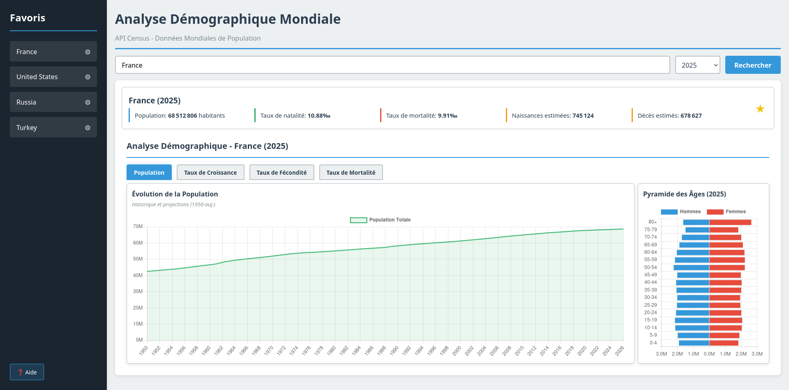
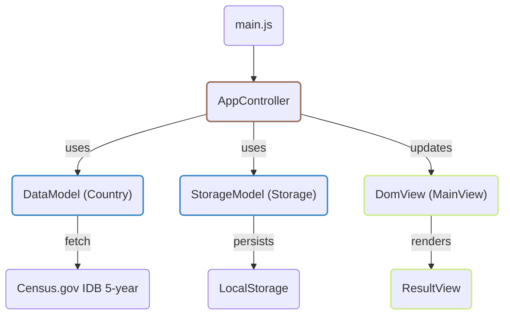

# Analyse Démographique Mondiale



Application web en **JavaScript vanilla (ES Modules)** qui interroge l'API **Census.gov (IDB 5-year)** pour afficher des indicateurs démographiques (population, naissances, décès, taux...) et des **visualisations Chart.js** (pyramide des âges, évolution de la population, croissance, fécondité, mortalité).

Projet réalisé dans le cadre d'un TP (architecture **MVC**).

## Démarrage rapide

Ce projet est 100% front-end (pas de build, pas de serveur Node requis).

### Option recommandée (serveur local)

```bash
python -m http.server 8000
```

Puis ouvrir: http://localhost:8000

### Option simple

Ouvrir `index.html` dans un navigateur moderne.

## Structure du dépôt

Projet en vanilla JS, compatible avec la plupart des navigateurs modernes.

```text
.
├── aide.html
├── help-style.css
├── index.html
├── style.css
├── docs/
│   └── showcase.png                      # Capture/illustration (à ajouter)
├── src/
│   ├── main.js                           # Entrée de l'application
│   ├── test-visualizations.js
│   ├── controllers/
│   │   └── AppController.js              # Contrôleur principal (orchestrateur)
│   ├── models/
│   │   ├── Country.js                    # Modèle API Census (IDB)
│   │   └── Storage.js                    # Modèle LocalStorage (favoris, état)
│   └── views/
│       ├── MainView.js                   # Vue DOM (résultats, favoris)
│       ├── ResultView.js                 # Vue Chart.js (graphiques)
│       └── ChartsView.js                 # Ancien/legacy (non central)
├── QUICKSTART.md
├── VISUALIZATIONS.md
├── IMPLEMENTATION_SUMMARY.md
└── VERIFICATION_CHECKLIST.md
```

## Le modèle MVC

Représentation globale de l'architecture MVC en place:



**Légende**

- Model en bleu
- View en vert
- Controller en brun

## API utilisée

- **Census.gov** (endpoint `timeseries/idb/5year`)
- Données exploitées: population, naissances/décès, taux (croissance, fécondité, mortalité), pyramide des âges.
- Clé API: optionnelle (voir `DataModel#setApiKey()` dans `src/models/Country.js`).

## Documentation

- `QUICKSTART.md` : guide d'utilisation rapide
- `VISUALIZATIONS.md` : détails techniques des graphiques
- `VERIFICATION_CHECKLIST.md` : checklist de validation

## Ajouter l'image du README

Enregistre la capture fournie dans `docs/showcase.png` (même nom), et elle s'affichera automatiquement en haut de ce README.
